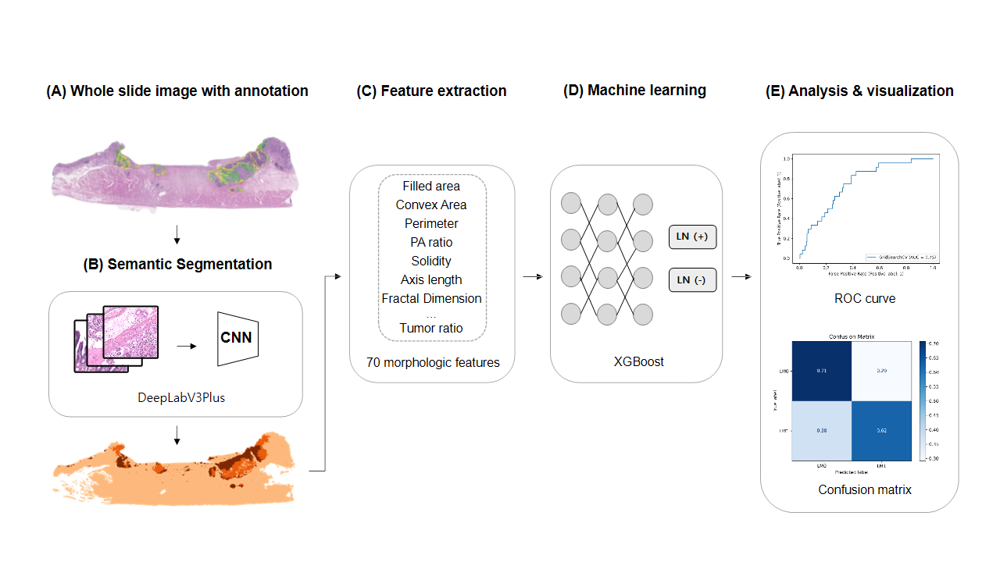

# lnm-prediction

Implementation of lnm-prediction: [Interpretable deep learning model to predict lymph node metastasis in early gastric cancer using whole slide images](https://www.ncbi.nlm.nih.gov/pmc/articles/PMC11301296/) (American Journal of Cancer Research)

## Abstract
In early gastric cancer (EGC), the presence of lymph node metastasis (LNM) is a crucial factor for determining the treatment options. Endoscopic resection is used for treatment of EGC with minimal risk of LNM. However, owing to the lack of definitive criteria for identifying patients who require additional surgery, some patients undergo unnecessary additional surgery. Considering that histopathologic patterns are significant factor for predicting lymph node metastasis in gastric cancer, we aimed to develop a machine learning algorithm which can predict LNM status using hematoxylin and eosin (H&E)-stained images. The images were obtained from several institutions. Our pipeline comprised two sequential approaches including a feature extractor and a risk classifier. For the feature extractor, a segmentation network (DeepLabV3+) was trained on 243 WSIs across three datasets to differentiate each histological subtype. The risk classifier was trained with XGBoost using 70 morphological features inferred from the trained feature extractor. The trained segmentation network, the feature extractor, achieved high performance, with pixel accuracies of 0.9348 and 0.8939 for the internal and external datasets in patch level, respectively. The risk classifier achieved an overall AUC of 0.75 in predicting LNM status. Remarkably, one of the datasets also showed a promising result with an AUC of 0.92. This is the first multi-institution study to develop machine learning algorithm for predicting LNM status in patients with EGC using H&E-stained histopathology images. Our findings have the potential to improve the selection of patients who require surgery among those with EGC showing high-risk histological features.

This git contains five directories: `1_wsi_processing/`, `2_deep_learning/`, `3_feature_extraction/`, `4_machine learning/`, `5_eda_visualize/`

The directory [1_wsi_processing](https://github.com/gotjd709/lnm-prediction/tree/master/1_wsi_processing) contains the source code of a patch generation and Whole Slide Image(WSI) inference.

The directory [2_deep_learning](https://github.com/gotjd709/lnm-prediction/tree/master/2_deep_learning) contains the source code of tumor semantic segmentation training.

The directory [3_feature_extraction](https://github.com/gotjd709/lnm-prediction/tree/master/3_feature_extraction) contains the source code of morphology feature extraction from tumor segmentation mask.

The directory [4_machine learning](https://github.com/gotjd709/lnm-prediction/tree/master/4_machine_learning) contains the source code of machine learning for predict lymphoma node metastasis.

The directory [5_eda_visualize](https://github.com/gotjd709/lnm-prediction/tree/master/5_eda_visualize) contains the source code of exploratory data analysis(EDA) and visualization of the results.
